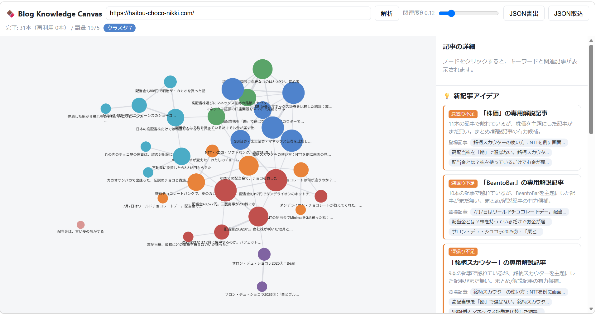

# Blog Knowledge Canvas

**A knowledge base that visualizes your blog's content structure and accelerates content strategy — born from a real problem: "I can't see what I've written or what's missing."**

Fetches all WordPress posts via REST API, analyzes keyword correlations using TF-IDF and Louvain clustering, renders an interactive graph on an infinite canvas, and automatically suggests new article ideas. **No backend. No LLM API. Runs entirely in the browser.**

---

## Why I Built This

| Before (Problem) | After (Solved by this tool) |
|---|---|
| As posts grew, it became impossible to track what was covered and what was missing | Visualize all post relationships as a graph; identify content gaps instantly |
| Sending posts to LLM APIs (ChatGPT, etc.) incurs ongoing monthly costs | Zero API cost — TF-IDF analysis runs fully in-browser |
| Writing posts reactively leads to poor content coverage and weak strategy | Automatically suggests new article ideas from unconnected keyword pairs and sparse clusters |
| Blogs with few tags or categories had no good analysis options | TF-IDF correlation works as the primary signal even with zero tags |

---

## Demo

> Verified on a live blog: `https://haitou-choco-nikki.com/`




---

## Features

**Content Analysis**
- Fetches all posts automatically via WordPress REST API (no proxy required — CORS is natively supported)
- Strips HTML and boilerplate CTA text before TF-IDF analysis
- Japanese tokenization via kuromoji.js (IPADIC), with compound-word merging for proper nouns

**Graph Visualization**
- Automatic cluster detection and color-coding via Louvain algorithm
- Real-time edge density control with a correlation threshold (θ) slider
- Click any node to inspect its keywords and related articles in the side panel
- Fast, readable layout via fcose

**New Article Idea Generation**
- Detects "association gaps" — keywords that frequently appear but have never been paired in an article
- Highlights sparse clusters — topic groups with few articles and room to expand
- Diversity cap prevents repetitive suggestions of the same keyword

**Data Management**
- Auto-caching via IndexedDB (incremental updates on re-analysis)
- Export/import analysis results as JSON for persistence or team sharing

---

## Architecture Decisions

> This section explains *why* each technology was chosen — the reasoning behind the design is as important as the implementation.

**Why no backend?**

WordPress REST API supports CORS natively, which means no proxy server is needed. The entire application can be hosted statically (GitHub Pages, Netlify, Vercel) with zero infrastructure overhead and zero ongoing server cost.

**Why no LLM API?**

For content strategy — determining which topics are *relatively* similar or distant — absolute semantic understanding is unnecessary. TF-IDF + Louvain delivers practical accuracy, verified on real blog data. Eliminating the LLM API removes ongoing cost for both the developer and end user, making the tool freely distributable.

**Why separate the data layer from the rendering layer?**

`graphology` (graph computation) and `Cytoscape.js` (rendering) are intentionally decoupled. This means:
- If the post count exceeds 5,000 and O(n²) pairwise computation becomes slow → swap in Approximate Nearest Neighbor (ANN) in the data layer only
- If the node count exceeds 1,000 and rendering lags → swap in Sigma.js (WebGL) in the rendering layer only

Each layer can evolve independently, minimizing the cost of scaling.

---

## Tech Stack

| Layer | Technology | Why |
|---|---|---|
| Framework | Vite + React + TypeScript | Type safety, fast builds |
| Japanese NLP | kuromoji.js (IPADIC, CDN dictionary) | In-browser Japanese morphological analysis |
| Graph computation | graphology + Louvain + centrality | Decoupled from rendering for scalability |
| Graph rendering | Cytoscape.js + fcose | High-performance layout for large graphs |
| Caching | IndexedDB (idb) | Offline support and incremental updates |

---

## Getting Started

### Prerequisites

- Node.js 18+
- npm 9+

### Installation

```bash
git clone https://github.com/<your-username>/blog-knowledge-canvas.git
cd blog-knowledge-canvas
npm install
```

### Start Development Server

```bash
npm run dev
```

Open `http://localhost:5173` in your browser.

> **First run**: kuromoji dictionary (a few MB) is fetched from CDN. Subsequent runs use the browser cache and start instantly.

### Production Build

```bash
npm run build
npm run preview   # Preview the build locally
```

The `dist/` folder can be deployed directly to GitHub Pages, Netlify, Vercel, or any static host.

---

## How to Use

### 1. Analyze Your Blog

Enter your WordPress blog URL (e.g., `https://example.com/`) in the top input field and click "Analyze." All posts are fetched and analyzed automatically.

### 2. Read the Graph

- Each node represents one article; edges connect articles with high keyword correlation
- Articles in the same cluster (topic group) share the same color
- Adjust the **correlation threshold (θ) slider** to control edge density — slide right to show only the strongest relationships

### 3. Inspect an Article

Click any node to see in the right panel:

- The article's top TF-IDF keywords
- A list of its most closely related articles

### 4. Get New Article Ideas

The **Idea Panel** (bottom right) automatically surfaces:

- **Association Gaps**: keyword pairs that frequently appear but have never been combined in a single article
- **Sparse Clusters**: topic groups with few articles — areas with the most room to expand

### 5. Save Your Analysis

Export results as JSON to save your work. Reimport the JSON file to restore the analysis instantly (no re-fetching or re-processing needed). The browser also auto-saves to IndexedDB, so revisiting the same browser resumes from where you left off with incremental updates only.

---

## Configuration

All key parameters are centralized in `src/config.ts`.

| Parameter | Description | Default |
|---|---|---|
| `initialTheta` | Initial correlation threshold | `0.15` |
| `knnLimit` | Maximum edges per article | `10` |
| `topKeywords` | Keywords displayed per article | `10` |
| `ctaMarkers` | Trigger phrases for CTA text removal | (pre-configured) |
| `ideaTermUseCap` | Max appearances of any term in idea suggestions | `2` |

---

## Custom Dictionary (Compound Nouns)

If proper nouns or brand names (e.g., "Monex Securities", "Bean to Bar") are being split into incorrect tokens, add them to the user dictionary.

**Steps:**

1. Add the term to `USER_DICTIONARY` in `src/nlp/userdict.ts` (exact spelling; spaces are stripped automatically)
2. Increment `TOKENIZER_VERSION` in `src/nlp/tokenize.ts`

Incrementing the version **automatically invalidates the IndexedDB cache** — all posts will be re-tokenized on the next analysis run. No manual cache clearing needed.

---

## Project Structure

```
src/
  ingest/       WordPress REST API fetcher
  nlp/          clean (HTML/CTA removal) · tokenize (kuromoji) · tfidf
  graph/        build (θ/kNN → graphology) · analyze (Louvain, centrality)
  ideas/        engine (diverge/converge suggestions, diversity cap)
  store/        IndexedDB cache + JSON import/export
  components/   Toolbar · CanvasGraph · SidePanel · IdeaPanel
  pipeline.ts   Orchestrates fetch → analyze → graph → ideas
  config.ts     Single source of truth for all parameters
```

---

## Roadmap

| Phase | Description | Trigger |
|---|---|---|
| Scale: data layer | Replace O(n²) pairwise computation with Approximate Nearest Neighbor (ANN) | 5,000+ posts |
| Scale: rendering layer | Replace Cytoscape.js with Sigma.js (WebGL) | 1,000+ nodes |
| Accuracy | Add tag co-occurrence as an additional correlation signal | When tag usage is consistent |
| Synonym merging | Add a curated synonym dictionary (similar to userdict) | When over-splitting appears |

---

## License

MIT

---

*Built to solve a real problem with my own Japanese stock investment blog. Validated on live data.*
*Designed with AI-assisted development (Claude Code).*
